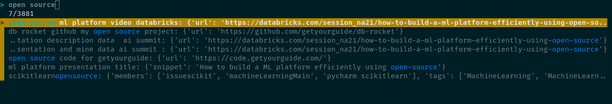

# search_run


- collect pieces of actionable text in the internet and add them to python dictionaries
- search them using a ML based ranking that minimizes your search time
- Run the searched entries, with customizeable actions
- add shortcuts to actions
- add custom types and actions


## How to use:

Create your own items, as you go:

```python
from search_run.cli import SearchAndRunCli
import datetime
from fire import Fire

data = {
    # a browser url, by defualt opens the browser
    "search browser": {
        "url": "https://google.com",
        # shortcuts are supported!
        "i3_shortcut": "Control+Shift+g",
    },
    # snippets to the clipboard
    "date current today now copy": {
        # the dict content can be processed on runtime rather than static strings
        "snippet": datetime.now().strftime("%Y-%m-%d %H:%M"),
    },
    # a shell command
    "watch current cpu frequency": {
        # a command will pop up a window with the results by default
        "cmd": """
                sudo watch \
                 cat /sys/devices/system/cpu/cpu*/cpufreq/cpuinfo_cur_freq
            """,
    },
}

instance = SearchAndRunCli(application_name="test", data=data)

Fire(instance)
```
UI example:




## Training models

### Predict entry complexity

Run the following notebooks in order:

- [Train model](notebooks/train_model.ipynb)
- [Predict ranking](notebooks/predict_ranking.ipynb)

## Legal

This project is licensed under the Apache License, Version 2.0. See [LICENSE](LICENSE.txt) for the full text.
