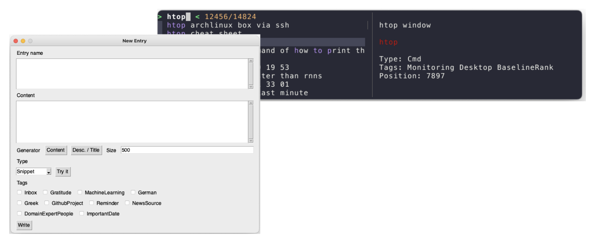

# PythonSearch



With python search you collect and retrieve and refactor information efficiently.

- collect commands, scripts, prompts, snippets, urls, files, efficiently as python dictionaries
- search them using a smart (ML based) ranking or add shortcuts to them
- refactor, reuse, generate and further automate entries as they are code
- execute the registered entries possibly customizing the execution behaviour
 
Check out [these slides](https://docs.google.com/presentation/d/10J0n0wdXYKCtB-tr2z4twY3T4TFBb8h2EGZghw7q1hk/edit#slide=id.p) if you want to know more


For an example of how an entries could look like see [here](https://github.com/jeanCarloMachado/PythonSearch/blob/e424868662bda4d9daa314e6e77d4cc79a511a95/python_search/init/entries_main.py).

Imagine having a program that can anticipate your next needs in the computer based on your current context and, on your request, suggest an automated way to do what you need to do next. PythonSearch tries to accomplishing "just" that by analyzing your user history and having a efficient way of cataloging  the things one can do in the computer.

## Minimal installation

This installation covers the minimun functionality of Python search.
Write a python script like this, and call it.

### 1. Install python search

```sh
pip install python-search && python_search install_missing_dependencies
```

We support **Mac and Linux**.
If you want to develop python-search install it via [the instructions in the contributing doc](CONTRIBUTING.md)

Everything in python search you do through the cli tool.
To understand the options run:

```sh
python_search --help
```


### 2. Initialize your entries project

```sh
python_search new_project "$HOME/projects/MyEntries"
```

It will create a new git project for you for your entries.

### 3. Using

Done! You can run the search UI by running.

```shell
python_search search
```

## LLM/ChatGPT integration is now available!

You can customize templated prompts, use them for different content and save them in python search see our [integration docs for details](https://github.com/jeanCarloMachado/PythonSearch/blob/main/docs/intergrate_chatgpt.md)

## Got an issue?

Create a github issue to report it or send a patch.

## Contributing

Feature contributions are also welcomed! If you want to be part of the roadmap discussions reach out.

## Contributors
 
- Aeneas Christodoulou
- Thallys Costa
- Jean Machado
- My Name


## Supported Systems

PythonSearch officially supports MacOS and Linux. 

## Legal

This project is licensed under the Apache License, Version 2.0. See [LICENSE](LICENSE) for the full text.\
Copyright 2022 Jean Carlo Machado


See also our [website](https://jeancarlomachado.github.io/PythonSearch/)
