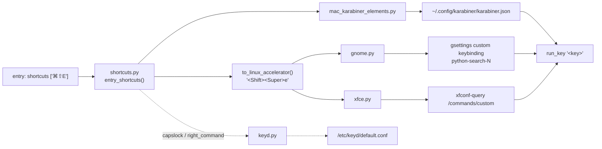

## Python Search Shortcuts

```py
entries = {
    # modifier + letter
    "open mail":            {"url": "https://mail.google.com", "shortcut": "⌥M"},
    "open calendar":        {"url": "https://calendar.google.com", "shortcut": "⌘⇧C"},
    "explain clipboard":    {"cmd": "prompt_editor ...", "shortcut": "⌃⌥E"},
    "lock screen":          {"cmd": "loginctl lock-session", "shortcut": "⌃⌥⇧⌘L"},

    # modifier + digit
    "open slack":           {"cmd": "slack", "shortcut": "⌘⇧1"},
    "open spotify":         {"cmd": "spotify", "shortcut": "⌥2"},

    # Space and Return
    "search entries":       {"cmd": "python_search search", "shortcut": "⌥Space"},     # macOS: see known issues
    "new terminal":         {"cmd": "kitty", "shortcut": "⌘↩"},                         # ↩, ⏎ and ⌤ all mean Return

    # punctuation
    "open docs":            {"url": "https://docs.python.org", "shortcut": "⌘⇧/"},      # macOS: see known issues
    "previous tab":         {"cmd": "...", "shortcut": "⌃⌥["},

    # lone keys
    "launcher":             {"cmd": "ps_ui show", "shortcut": "capslock"},              # Linux: via keyd
    "register new":         {"cmd": "python_search register_new_ui", "shortcut": "right_command"},  # Linux: via keyd
    "toggle dictation":     {"cmd": "...", "shortcut": "right_gui"},                    # macOS only
    "screenshot area":      {"cmd": "...", "shortcut": "right_gui_shift"},              # macOS only (right ⌘ + left ⇧)
    "translate clipboard":  {"cmd": "...", "shortcut": "right_alt"},                    # macOS only

    # several shortcuts for one entry
    "open github":          {"url": "https://github.com", "shortcuts": ["⌥G", "⌘⇧G"]},
    # `shortcut` and `shortcuts` together: all three are bound
    "open notes":           {"cmd": "obsidian", "shortcut": "⌥N", "shortcuts": ["⌘⇧N", "⌃⌥N"]},
}
```

Then bind them:

```sh
python_search shortcuts
```

Define each shortcut once, with `shortcut` (one) or `shortcuts` (a list); the same definition is
used on every supported system:

- Mac using Karabiner Elements
- Linux
  - Gnome
  - XFCE

## Reference

### Entry fields

| Field | Type | Example |
|---|---|---|
| `shortcut` | string, one shortcut | `"shortcut": "⌥Space"` |
| `shortcuts` | list of shortcuts | `"shortcuts": ["⌥M", "⌘⇧M"]` |

Both may be set on the same entry; all shortcuts from both are bound. The old per-platform fields
(`mac_shortcut(s)`, `xfce_shortcut(s)`) are no longer read.

### Modifiers

A shortcut is zero or more modifier glyphs followed by one key. Order and spaces don't matter.

| Glyph | Mac | Linux (GTK accelerator) |
|---|---|---|
| `⌘` | Command | Super (`<Super>`) |
| `⌥` | Option | Alt (`<Alt>`) |
| `⌃` | Control | Control (`<Control>`) |
| `⇧` | Shift | Shift (`<Shift>`) |

### Keys

| Key | Written as | Mac | Linux |
|---|---|---|---|
| Letter | `A`–`Z` (case ignored) | ✓ | ✓ |
| Digit | `0`–`9` | ✓ | ✓ |
| Return | `↩`, `⏎` or `⌤` | ✓ | ✓ (`Return`) |
| Space | `Space` | ✗ see [known issues](#known-issues) | ✓ (`space`) |
| Punctuation | `.` `,` `/` `;` `'` `[` `]` `-` `=` `` ` `` `\` | ✗ see [known issues](#known-issues) | ✓ (`period`, `comma`, …) |

### Special shortcuts

These are written on their own, without modifiers.

| Shortcut | Binds | Mac | Linux |
|---|---|---|---|
| `capslock` | Caps Lock | ✓ | via keyd: `capslock = C-A-M-space`, bound as `<Control><Alt><Super>space` |
| `right_command` | right Command / Super | ✓ | via keyd: `rightmeta = C-A-M-r`, bound as `<Control><Alt><Super>r` |
| `right_gui` | right Command | ✓ | skipped |
| `right_gui_shift` | right Command + left Shift | ✓ | skipped |
| `right_alt` | right Option | ✓ | skipped |

`capslock` and `right_command` accept `_`, spaces and any case (`caps_lock`, `Right Command`).

On Linux, `python_search shortcuts` adds the keyd line to `/etc/keyd/default.conf` (asking for
`sudo`) and runs `keyd reload`. If keyd already maps that key to something else, a warning is
printed and the existing mapping is kept.

### Commands

| Command | What it does |
|---|---|
| `python_search shortcuts` | Generate the bindings for the current platform: Karabiner on macOS, otherwise GNOME or XFCE |
| `run_shortcut '<shortcut>'` | Run the entry that owns the shortcut, e.g. `run_shortcut '⌘⇧E'`. Matching ignores spaces and case |

## How it works

How one `shortcuts` definition becomes a binding on each platform (`python_search/shortcut/`):



Every binding runs the entry through `run_key` (with `--from_shortcut=True` on Linux).

### macOS (Karabiner Elements)

`~/.config/karabiner/karabiner.json` is rebuilt from `karabiner_base.json` plus one rule per
shortcut, so rules edited by hand in that file are overwritten. Put permanent rules in
`karabiner_base.json`.

### GNOME

Each shortcut becomes a custom keybinding named `python search: <key>` under the `python-search-`
prefix. Only those keybindings are replaced on each run, so shortcuts you added in GNOME Settings are
kept. When a GNOME built-in or shell-extension binding uses the same accelerator (for example `⌘1`,
Super+1, which switches to the first dash app), it is removed from that binding so the entry
shortcut wins, and a message says which one was overridden. If two entries use the same shortcut,
the first one wins and the second is skipped.

### XFCE

Each shortcut is written with `xfconf-query` to `/commands/custom/<accelerator>` in the
`xfce4-keyboard-shortcuts` channel.

## Known issues

- On macOS, `Space` and punctuation keys are not translated for Karabiner: `⌥Space` is bound as
  `⌥E` (the last letter of "Space"), and `⌘⇧.` gets no key at all. Use letters, digits, Return or
  the special shortcuts on macOS until this is fixed in `mac_karabiner_elements.py`.
